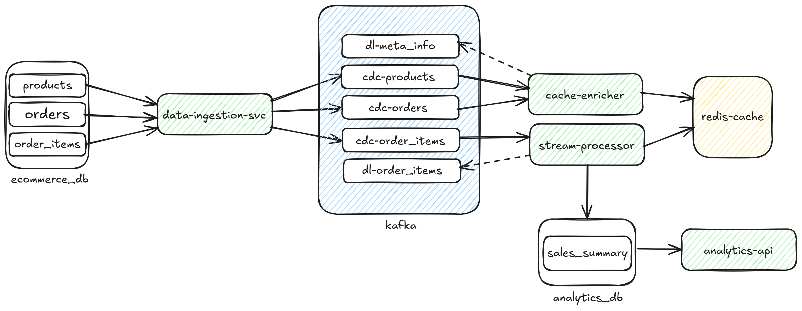
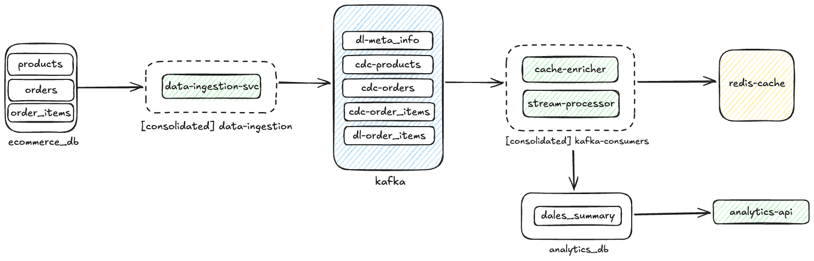

# [WSO2 Integrator] CDC Pipeline - Real-time E-commerce Analytics

[](https://github.com/ayeshLK/cdc-pipeline/actions)

A real-time analytics pipeline using Change Data Capture (CDC) to process e-commerce transactions. The system captures database changes, streams them through Kafka, enriches with cached data, and aggregates sales analytics.

## Architecture Overview



Following diagram describes the dependencies between the packages inside the Ballerina workspace.


Following the Ballerina service consolidation, the diagram below illustrates the final consolidated system components.



### System Components

**Infrastructure Layer:**
- **MySQL Source** (port 3306) - E-commerce transactional database with CDC enabled
- **MySQL Sink** (port 3307) - Analytics database storing aggregated results
- **Apache Kafka** (port 9092) - Event streaming platform
- **Redis** (port 6379) - Cache layer for data enrichment

**Application Services:**
1. **data-ingestion-svc** (port 19091)
   - Captures CDC events from MySQL binlog
   - Publishes changes to Kafka topics: `cdc-products`, `cdc-orders`, `cdc-order_items`
   - Uses Ballerina CDC connector with Debezium

2. **kafka-consumer-svc** (port 19092)
   - **Cache Enricher**: Consumes product and order events, populates Redis cache
   - **Stream Processor**: Consumes order items, enriches with cached data, computes aggregates
   - Writes aggregated sales data to analytics database

3. **analytics-api** (port 9090)
   - REST API to query aggregated sales analytics
   - Endpoints: `/analytics/merchant/{id}`, `/analytics/category/{name}`

### Codebase Structure

```
cdc-pipeline/
├── compose-infrastructure.yml    # Docker Compose for infrastructure
├── workspace/                    # Ballerina workspace (monorepo)
│   ├── commons/                 # Shared types (Order, Product, OrderItem, AggregatedSales)
│   ├── data-ingestion/          # CDC listener module
│   ├── cache-enricher/          # Redis caching module
│   ├── stream-processor/        # Event processing and aggregation module
│   ├── analytics-db/            # Database persistence layer
│   ├── analytics-api/           # REST API module
│   ├── data-ingestion-svc/     # Service wrapper for data-ingestion
│   ├── kafka-consumer-svc/     # Consolidated service (cache-enricher + stream-processor)
│   └── Ballerina.toml          # Workspace configuration
├── mysql/
│   ├── source-init/            # Source database initialization scripts
│   └── sink-init/              # Sink database initialization scripts
└── seed.sh                     # Database seeding script
```

## Prerequisites

Before running the setup, ensure you have the following installed:

- **Docker** and **Docker Compose** - For infrastructure setup
- **Ballerina** (version 2201.13.1) - For building and running services
  ```bash
  # Install Ballerina from https://ballerina.io/downloads/
  ```

## Getting Started

### 1. Start Infrastructure

Start MySQL (source & sink), Kafka, and Redis using Docker Compose:

```bash
docker compose -f compose-infrastructure.yml up -d
```

Verify all services are healthy:
```bash
docker compose -f compose-infrastructure.yml ps
```

Expected output: All services should show status as "healthy" or "running".

### 2. Seed Source Database (Optional)

Populate the source database with sample e-commerce data:

```bash
./seed.sh
```

This script inserts sample products, orders, and order items, and triggers some CDC events (updates, deletes).

### 3. Build Services

Build all Ballerina packages:

```bash
cd workspace
bal build
```

### 4. Run Application Services

Start the services **in the following order**:

#### a) Start Data Ingestion Service

Captures CDC events from MySQL and publishes to Kafka:

```bash
cd workspace/data-ingestion-svc
bal run
```

**Health check:** http://localhost:19091/health

#### b) Start Kafka Consumer Service

Runs both cache enricher and stream processor:

```bash
cd workspace/kafka-consumer-svc
bal run
```

**Health check:** http://localhost:19092/health

**Important:** This service must process some events before the analytics API can return data.

#### c) Start Analytics API

Exposes REST endpoints for querying analytics:

```bash
cd workspace/analytics-api
bal run
```

**Health check:** http://localhost:9090/health

### 5. Verify Setup

Query analytics data:

```bash
# Get sales analytics for merchant ID 10
curl http://localhost:9090/analytics/merchant/10

# Get sales analytics for Electronics category
curl http://localhost:9090/analytics/category/Electronics
```

## Service Startup Order

**CRITICAL:** Services must start in this exact order to avoid data loss:

1. **Infrastructure** (MySQL, Kafka, Redis) - Must be healthy before starting services
2. **data-ingestion-svc** - Captures CDC events and populates Kafka topics
3. **kafka-consumer-svc** - Cache enricher MUST populate Redis before stream processor runs
4. **analytics-api** - Can start anytime after the database has aggregated data

Starting services out of order will cause events to be pushed to dead-letter queues.

## Configuration

Each service has a `Config.toml` file for customization:

- **Database connections**: hostname, port, username, password
- **Kafka settings**: bootstrapServers, topic names
- **Redis settings**: host, port, cache expiry
- **HTTP ports**: service listener ports

Example configuration files are included in each service directory.

## Testing

Run tests for all services:

```bash
cd workspace
bal test
```

## API Documentation

### Analytics API Endpoints

**Base URL:** `http://localhost:9090`

#### Get Merchant Analytics
```
GET /analytics/merchant/{merchantId}
```
Returns aggregated sales data for a specific merchant, grouped by timestamp and category.

**Example:**
```bash
curl http://localhost:9090/analytics/merchant/10
```

#### Get Category Analytics
```
GET /analytics/category/{category}
```
Returns aggregated sales data for a specific category, grouped by timestamp and merchant.

**Example:**
```bash
curl http://localhost:9090/analytics/category/Electronics
```

## Kafka Topics

- `cdc-products` - Product change events
- `cdc-orders` - Order change events
- `cdc-order_items` - Order item change events
- `dl-order_items` - Dead letter queue for failed order items
- `dl-sales_analysis` - Dead letter queue for failed analytics writes
- `dl-meta_info` - Dead letter queue for cache enrichment failures

### Monitoring Kafka

```bash
# List all topics
docker exec -it kafka /opt/kafka/bin/kafka-topics.sh --bootstrap-server localhost:9092 --list

# Consume messages from a topic
docker exec -it kafka /opt/kafka/bin/kafka-console-consumer.sh --bootstrap-server localhost:9092 --topic cdc-order_items --from-beginning

# Check consumer groups
docker exec -it kafka /opt/kafka/bin/kafka-consumer-groups.sh --bootstrap-server localhost:9092 --list
```

## Database Access

Access MySQL databases directly:

```bash
# Source database (e-commerce data)
docker exec -it mysql-source mysql -uroot -proot ecommerce_db

# Sink database (analytics data)
docker exec -it mysql-sink mysql -uroot -proot analytics_db
```

## Troubleshooting

### Events Going to Dead Letter Queue

If events are being pushed to DLQ topics:
1. Check if **kafka-consumer-svc** is running (cache enricher populates Redis)
2. Verify Redis connectivity: `docker exec -it redis-standalone redis-cli ping`
3. Check service logs for cache lookup failures
4. Ensure products and orders are cached before order items are processed

### No CDC Events Captured

1. Verify MySQL binlog is enabled:
   ```sql
   SHOW VARIABLES LIKE 'log_bin';
   ```
2. Check Debezium user privileges:
   ```sql
   SHOW GRANTS FOR 'debezium'@'%';
   ```
3. Verify data-ingestion-svc is running and healthy
4. Check Kafka connectivity

### Service Won't Start

1. Verify `Config.toml` exists and has correct connection details
2. Ensure all dependencies are built: `bal build` in workspace root
3. Check if required ports are available (3306, 3307, 9092, 6379, 9090, 19091, 19092)
4. Review service logs for specific error messages

## Stopping the System

Stop all services gracefully:

```bash
# Stop application services (Ctrl+C in each terminal)

# Stop infrastructure
docker compose -f compose-infrastructure.yml down

# Remove volumes (optional - deletes all data)
docker compose -f compose-infrastructure.yml down -v
```
